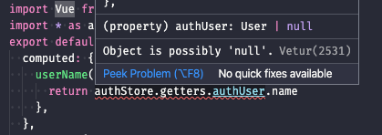

> TLDR: In this article, we discuss having fully type-checked Vuex stores. Full code is available in [vinicius0026/properly-typed-vuex-stores](https://github.com/vinicius0026/properly-typed-vuex-stores).
>
> You can also read this on [Medium](https://medium.com/swlh/properly-typed-vuex-stores-427bf4c6a3d1).

---

This is the first article in our Structuring Large Vue.js Applications series. Here is the full list of released and planned articles:

- [Properly typed Vuex Stores](https://viniciusteixeira.tk/2020/05/14/properly-typed-vuex-stores/) _published May 13, 2020_ - **You are here**
- [Adopting TypeScript in your Vue.js Application in a sane way](https://viniciusteixeira.tk/2020/05/14/adopting-typescript-in-your-vue-application-in-a-sane-way/) _published May 14, 2020_
- [Modularizing the logic of your Vue.js Application](https://viniciusteixeira.tk/2020/05/15/modularizing-the-logic-of-your-vue-application/) _published May 15, 2020_
- [Data-driven components](https://viniciusteixeira.tk/2020/05/25/data-driven-components/) _published May 25, 2020_
- <ins>Using services to establish a clear boundary in your Vue.js application</ins> _coming soon_

---

[Vue.js](https://vuejs.org/) and [TypeScript](https://www.typescriptlang.org/) are two trending topics in front-end development.

Vue.js calls itself "The Progressive JavaScript Framework", meaning by that that the entry barrier to start using it is very low, but as one's needs grow, Vue's capabilities and its ecosystem will be there to match those needs.

One of the common patterns mid-sized to large applications need is centralized state management. Whenever your Vue app needs that, the no-brainer choice is [Vuex](https://vuex.vuejs.org/), Vue's own implementation of "State Management Pattern".

When apps start to grow beyond mid-size, TypeScript start to be more and more valuable to manage complexity.

This article discusses ways of putting all this together, to have a solid base for a large application using Vue, Vuex, and TypeScript.

## Default Setup

Thanks to the fantastic [`vue-cli`](https://cli.vuejs.org/) tool, it is straightforward to start a Vue + Vuex + TypeScript project.

After installing `vue-cli`, just run `vue create <project name>`, answer a few questions and you will be up and running. Make sure to select **Manually select features** in the **Please pick a preset** stage and check `TypeScript` and `Vuex`.


When `vue-cli` finishes scaffolding the app and installing all dependencies, we will have a Vuex store stubbed out for us, in TypeScript:

```typescript
// src/store/index.ts
import Vue from "vue";
import Vuex from "vuex";

Vue.use(Vuex);

export default new Vuex.Store({
  state: {},
  mutations: {},
  actions: {},
  modules: {}
});
```

For large-sized app, we should break our store into modules to make it more manageable. Let's create an `auth` module, where we will keep track of the authenticated user in our app.

First, create a `modules` directory under `store` and create an `auth.ts` file inside of it.

```shell
# pwd is the root of the generated app
$ mkdir src/store/modules
$ touch src/store/modules/auth.ts
```

And then let's create the Auth Store:

```typescript
// src/store/modules/auth.ts

// state
interface User {
  name: string
}

interface AuthState {
  authUser: User | null
}

const state: AuthState = {
  authUser: null
}

// getters
function authUser(state: AuthState) {
  return state.authUser
}

const getters = {
  authUser,
}

// mutations
function setUser(state: AuthState, user: User) {
  state.authUser = user
}

const mutations = {
  setUser,
}

// actions
const actions = {}

export default {
  state,
  getters,
  mutations,
  actions,
}
```

Here we are defining simplistic `User` interface, with just a name; an `AuthState` interface to use as the type for our store's state; and a pair of getter and a mutation to get and set the user.

We can now register this module in the root store:

```typescript{4,12,13,14}
// src/store/index.ts
import Vue from "vue"
import Vuex from "vuex"
import auth from "./modules/auth"

Vue.use(Vuex)

export default new Vuex.Store({
  state: {},
  mutations: {},
  actions: {},
  modules: {
    auth,
  },
})
```

With that wired up, we can use the `auth` store in our app. Let's add a login link that will eventually call our `auth` store to set the `authUser` to a fake user.

```vue
// src/App.vue
<template>
  <div id="app">
    <div id="nav">
      <router-link to="/">Home</router-link> |
      <router-link to="/about">About</router-link> |
      <a href="#" @click="login">Login</a>
    </div>
    <router-view />
  </div>
</template>

<script lang="ts">
import Vue from 'vue'
export default Vue.extend({
  methods: {
    login() {
      console.log('called login method')
    }
  }
})
</script>
```

Here we have a couple of options when it comes to accessing our store from a component. We can either use the `$store` accessor in the Vue component object or use Vuex helpers such as `mapGetters` and `mapMutations`. Let's try both.

Using `this.$store` is pretty straightforward:

```typescript
import Vue from 'vue'
export default Vue.extend({
  methods: {
    login() {
      const fakeUser = {
        name: 'Fake User'
      }

      this.$store.commit('setUser', fakeUser)
    }
  }
})
```

Using the `mapMutations` helper is just a tiny bit more involved:

```typescript
import Vue from "vue"
import { mapMutations } from "vuex"
export default Vue.extend({
  methods: {
    ...mapMutations(["setUser"]),
    login() {
      const user = {
        name: "Fake User",
      }

      // mapMutations will effectively create a method in our component with the same name as our mutation
      this.setUser(user)
    },
  },
})
```

Both work fine, as we can check by using [`vue-devtools`](https://github.com/vuejs/vue-devtools):


But neither is a great experience with regards to type checking. Although we have added types to all the parameters in our store, we don't get type-checking for the store mutation.


And in fact, they can lead to a bad state to be committed to the store:


But there is a Better Way™.

## A Better Way™

To have our store functions properly type-checked, we will use [`vuex-typex`](https://github.com/mrcrowl/vuex-typex), a nice but oddly still little used library.

```
$ npm install -S vuex-typex
```

We will have to write our store in a slightly different way, but it will pay off by enabling type-checking across our whole app.

First of all, we will have to create a new file, where we will declare our RootState interface, and we will create our `storeBuilder` object from `vuex-typex`, based on our `RootState`.

```typescript
// src/store/RootState.ts
import { getStoreBuilder } from "vuex-typex"
import { AuthState } from "./modules/auth"

export interface RootState {
  auth: AuthState
}

export const storeBuilder = getStoreBuilder<RootState>()
```

Now, let's rewrite our `auth` module to use `vuex-typex`:

```typescript
// src/store/modules/auth.ts
import { storeBuilder, RootState } from "@/store/RootState"

interface User {
  name: string
}

// state
export class AuthState {
  authUser: User | null = null
}

const b = storeBuilder.module<AuthState>("auth", new AuthState())

// getters
const authUser = b.read((state) => state.authUser, "authUser")

export const getters = {
  get authUser() {
    return authUser()
  },
}

// mutations
function setUser(state: AuthState, user: User) {
  state.authUser = user
}

export const mutations = {
  setUser: b.commit(setUser),
}
```

There's a lot going on here. First, we have changed our `AuthState` declaration from a typescript `interface` to a `class`. Then, we are using this class to instantiate a module builder that we call just `b` for ease of access. Notice how we are passing the `AuthState` as a type parameter to the `storeBuilder.module` call, and also using it to instantiate our initial state, by calling `new AuthState()`.

Using the module builder, we can now declare our getter and our mutation. We use `b.read` to declare getters and `b.commit` to call mutations. Instead of exporting a default object with the state, getters, mutations, and actions, we individually export the state, getters, and mutations.

Now we need to change the store's index file to use `vuex-typex`:

```typescript
// src/store/index.ts
import Vue from "vue"
import Vuex from "vuex"
import "./modules/auth"
import { storeBuilder } from "./RootState"

Vue.use(Vuex)

export default storeBuilder.vuexStore()
```

It got actually simpler than before. One caveat here is that we have to make sure the modules are evaluated before we import the `storeBuilder` from the `RootState` file. We achieve that by an anonymous import (line 4 in the code above).

We now have to update the component's code. Instead of using `this.$store` or `mapMutations`, we are going to import the `auth` store module directly.

```typescript
// src/App.vue
import Vue from "vue"
import * as authStore from "@/store/modules/auth"
export default Vue.extend({
  methods: {
    login() {
      const user = {
        name: "Fake User",
      }

      authStore.mutations.setUser(user)
    },
  },
})
```

And now we have type-checking in our store!


And the type-checker will warn us of any mismatch on the types.


### Getters

Getters are also type-checked as we can confirm by accessing the `authUser`:


Notice the use of the [optional chaining operator `?`](https://www.typescriptlang.org/docs/handbook/release-notes/typescript-3-7.html#optional-chaining). If we remove it, we will have a type error, because the `authUser` is possibly `null`.



### Actions

Declaring actions in our type-checked store requires just a bit more effort than getters and mutations. We need to create a new type for the action context, like so:

```typescript
// src/store/modules/auth.ts
import { BareActionContext } from 'vuex-typex'

// all code from before

// actions
type ActionContext = BareActionContext<AuthState, RootState>

async function login(context: ActionContext, payload: {username: string, password: string}) {
  const { username, password } = payload
  const user = await fakeUserLoginService(username, password)
  if (user) {
    mutations.setUser(user)
  }
}

export const actions = {
  login: b.dispatch(login),
}

// fake async call
async function fakeUserLoginService(username: string, password: string): Promise<User | null> {
  return {
    name: "Fake User",
  }
}
```

Here we declare a `login` action that, like any other Vuex action, takes the `context` as the first argument. In this case, we use a special type for the context to be able to access, if needed, the current module state or global state inside the action.

The second parameter to the `login` action is whatever we need to perform this action. Here we are using an object to pass in a `username` and a `password`, but it can be anything.

We defined a fake user service to represent the async call that would eventually return the user if the login is successful, and then we are calling the `setUser` mutation.

To wire this action up to the store, we use the module builder `dispatch` method (`b.dispatch`).

We can now update our component to use this action to log the user in:

```typescript
import Vue from "vue"
import * as authStore from "@/store/modules/auth"
export default Vue.extend({
  computed: {
    userName() {
      return authStore.getters.authUser?.name
    },
  },
  methods: {
    async login() {
      const username = "user"
      const password = "secret"
      try {
        await authStore.actions.login({ username, password })
      } catch (err) {
        console.error(err)
      }
    },
  },
})
```

We now have a fully type-checked store!

## Conclusion

`vue-cli` provides an effortless way to get up and running with a standard Vue application layout. But, unfortunately, Vuex doesn't have full support for TypeScript out of the box.

We are getting close to [Vue 3 launch](https://madewithvuejs.com/blog/vue-3-roundup), and it will have native support for TypeScript. [Vuex 4.0](https://github.com/vuejs/vuex/releases/tag/4.0.0-beta.2) (that will be the version compatible with Vue 3) is still in Beta at the time of this writing, and it still doesn't provide full type-checking for Vuex stores declared with TypeScript. We hope to see improvements in type-checking as it gets closer to be released.

Anyway, for all the Vue 2.* applications out there, this article should help to get TypeScript's full power to Vuex Stores.

**Shameless Plug**: If you liked this article and there are openings in our company, I'm currently looking for a job as a Senior Full Stack Engineer. You can check my [Linkedin](https://www.linkedin.com/in/antonioviniciusteixeira/) and drop me a line at _vinicius0026 at gmail dot com_ if you think I'm a good fit. Cheers! :)
