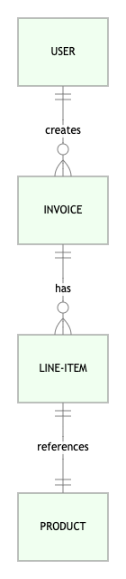
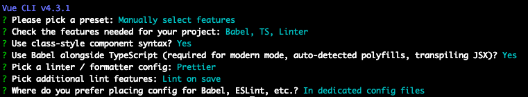
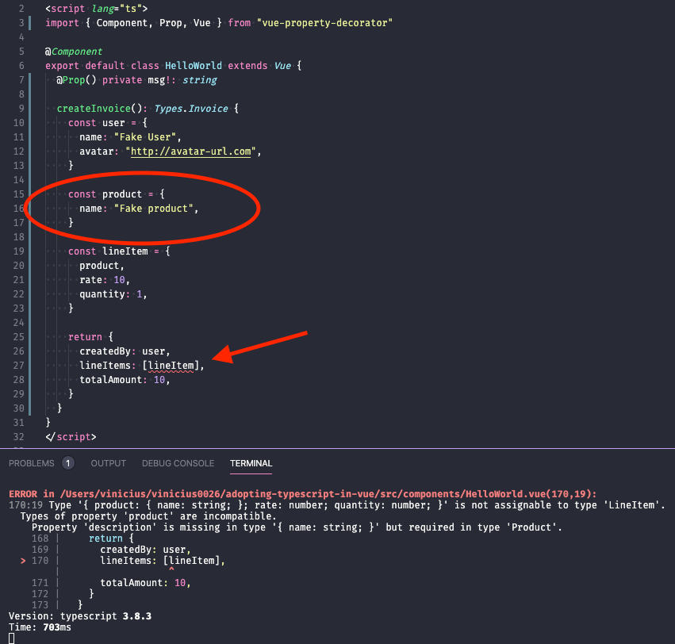
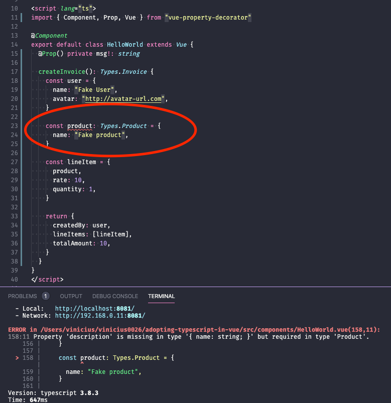
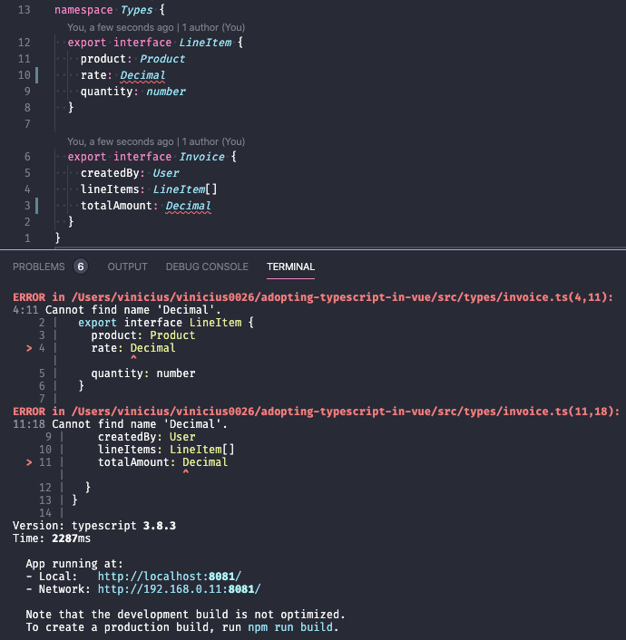
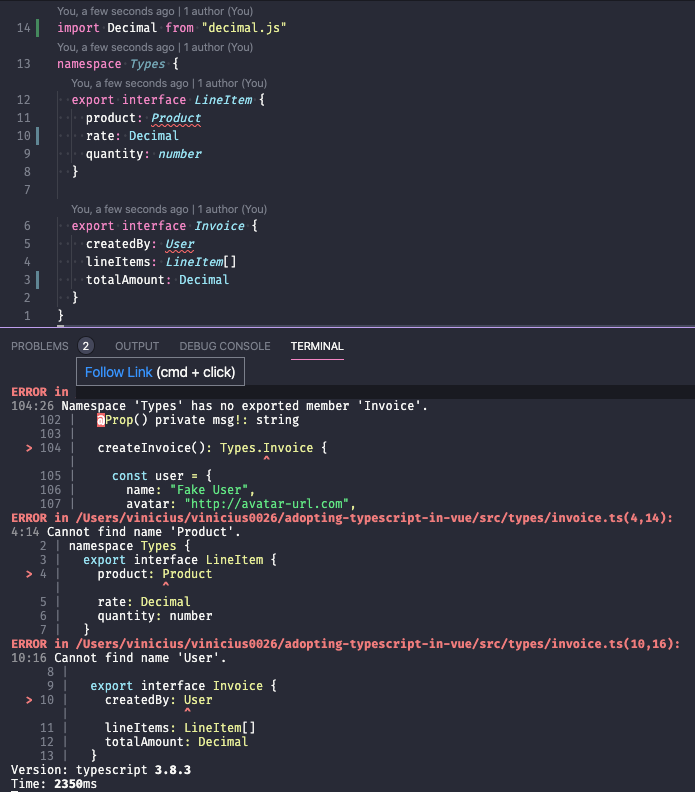

> TLDR: We discuss adopting TypeScript in Vue.js applications in a simple yet powerful and maintainable way. The final code is available at [vinicius0026/adopting-typescript-in-vue](https://github.com/vinicius0026/adopting-typescript-in-vue)

---

This is the second article in our Structuring Large Vue.js Applications series. Here is the full list of released and envisaged articles:

- [Properly typed Vuex Stores](https://viniciusteixeira.tk/2020/05/14/properly-typed-vuex-stores/) _published May, 13th 2020_
- [Adopting TypeScript in your Vue.js Application in a sane way](https://viniciusteixeira.tk/2020/05/14/adopting-typescript-in-your-vue-application-in-a-sane-way/) _published May 14th, 2020_ - **You are here**
- <ins>Modularizing the logic of your Vue.js Application</ins> _coming soon_
- <ins>Using services to establish a clear boundary in your Vue.js application</ins> _coming soon_

---

As a JavaScript application starts to grow, having type hints and type checking helps immensely with code self-documentation and with refactoring. This is not different for Vue.js applications, so if your app is growing and you are seeing a lot of `Cannot read property 'x' of undefined` in your error logs, you probably should consider giving TypeScript a shot.

In the past, I have been skeptical about TypeScript benefits, but after adopting in in a fairly large Vue.js codebase, I'm not looking back and will definitely use it even for small/mid apps.

One of the misconceptions I've seen when it comes to adopting TypeScript is that it means you should use an Object-Oriented way of building your app, using classes all around to model your data. That is obviously an option, but it is definitely not mandatory, and, in my opinion, it is not the best way to go. In this article, we will explore using `interfaces` instead of `classes` as a lean way of adding types to your data. This will make TypeScript easier to adopt and maintain.

In a future article, I'll discuss modularizing the application logic, by having a functional core for the application, which will heavily use the TypeScript basis we will lay in this article.

I hope I'm able to deliver on the goal of providing a sane way of using TypeScript in a Vue.js application. If I'm successful, I hope you will give TypeScript a shot in your current or next Vue.js app!

Let's get started.

## Data Model

In order to have a concrete example to play with, we are going to use a simplified model for an Invoice application. These are the main models and their relationships for our example app:



Putting it in words, a `User` creates an `Invoice`, which is comprised of multiple `LineItems`, which in turn reference a `Product`. The `User` will have a name and an avatar, the `Invoice` will have a total amount, the `LineItem` will have a rate and a quantity, and the `Product` will have a name and a description.

Let's create some interfaces representing these types. We will discuss where to put these in a bit, but we can start thinking in terms of typed data structures from now on.

```typescript
interface User {
  name: string
  avatar: string
}

interface Product {
  name: string
  description: string
}

interface LineItem {
  product: Product
  rate: number
  quantity: number
}

interface Invoice {
  createdBy: User
  lineItems: LineItem[]
  totalAmount: number
}
```

For now, we are using `number` for the `Product.rate` and the `Invoice.totalAmount`. In any application that deals with money, we must avoid using raw numbers (or floats in other languages) and should use a Decimal type. Later in this article, we will address this issue by using [`decimal.js`](https://github.com/MikeMcl/decimal.js/) instead of plain numbers for these fields.

## Scaffolding the app

In order to add these types to an actual Vue.js application, we can generate a new app from scratch using [`vue-cli`](https://cli.vuejs.org/). This is the full config I'm using for this article (don't worry, you should be able to use the recommendations in this article in any setup):



At this point, we have a nice base to start developing our app.

## Adding our type definitions to the app

Now comes the question, where should we put the interfaces we have declared above? To answer this question, we need to define some properties we want from whatever solution we adopt. In my opinion, these are the properties we should have for our type definitions:

- Easy to access from the whole application
- Ability to modularize the definitions, grouping related interfaces together
- Easy to change when needed

After defining these constraints, we can think about the things we don't want:

- Having to import the interface declaration in every file we use them
- Having to fix import paths and references when we move an interface declaration from one place to the other

[TypeScript Namespaces](https://www.typescriptlang.org/docs/handbook/namespaces.html) are a great way to achieve all the desired properties while avoiding the unwanted behavior. We will put our interface definitions in a `types` directory under the `src` folder. Inside this directory, we will create as many files as we need to group related types together. In each of these files, we will use the same `Types` namespace.

For this example, we will need 3 files. In the first one, we will declare the User related interfaces. For now, we will just have the user interface itself.

```typescript
// src/types/user.ts
namespace Types {
  export interface User {
    name: string
    avatar: string
  }
}
```

In the second file, let's put the `Product` related interfaces. For now the only interface we will have here is the `Product` interface itself, but, in the future, we might add product categories and other related types.

```typescript
// src/types/product.ts
namespace Types {
  export interface Product {
    name: string
    description: string
  }
}
```

And finally, in the third file, we will declare the `Invoice` related interfaces, which are the `Invoice` itself and the `LineItem` interfaces. The `LineItem` interface doesn't seem to deserve its own file at this point, because it is closely related to the Invoice. We can always move it to its own file later if that makes sense.

```typescript
// src/types/invoice.ts
namespace Types {
  export interface LineItem {
    product: Product
    rate: number
    quantity: number
  }

  export interface Invoice {
    createdBy: User
    lineItems: LineItem[]
    totalAmount: number
  }
}
```

There are a few things to note here. First of all, notice how we have used the same `Types` namespace in all these files. That is possible thanks to [TypeScript's Multi-File Namespaces](https://www.typescriptlang.org/docs/handbook/namespaces.html#multi-file-namespaces).

Another thing we did was to export the interfaces. This way, all of the declared interfaces will be available under `Types.SomeInterface`.

Finally, note that when using the types declared in a different file, but in the same namespace, we don't need to use the `Types` namespace to access them, as we can see in the `invoice.ts` declarations, where we were able to reference the `Product` and `User` interfaces even though they were declared in separate files.

## Using the declared types in a Vue component

Let's see how we would use these types in a Vue component now. We will do that by creating a method in the generated `HelloWorld.vue` component and adding some type annotations to it.

```typescript
// src/components/HelloWorld.vue
export default class HelloWorld extends Vue {
  @Prop() private msg!: string

  createInvoice(): Types.Invoice {
    const user = {
      name: "Fake User",
      avatar: "http://avatar-url.com",
    }

    const product = {
      name: "Fake product",
      description: "not a real product",
    }

    const lineItem = {
      product,
      rate: 10,
      quantity: 1,
    }

    return {
      createdBy: user,
      lineItems: [lineItem],
      totalAmount: 10,
    }
  }
}
```

This is a bit contrived example, but we were able to access the interfaces declared in our `Types` namespace and we have full type checking in the component. We can see that it is working by removing any of the required properties from some of these objects and see how the type checker will raise an exception.



In the image above we can see that the TypeScript checker is erring out after we have removed the `description` property from our `product` object. If we add a type annotation to the `product` object instead of relying just on type inference, we will see the error being reported for it instead of for the `invoice` object.



Let's sit back and review what we have just done. With very little effort, we were able to define types for our data in a way that is modular, easy to change, and easy to access from anywhere in our application. We used a bit contrived example, but we will expand on that in future articles, when we discuss modularizing our application logic and establishing a clear boundary using services.

## Using third-party defined types

Before we finish, let's take care of the `number` types we temporarily used in the `LineItem` and `Invoice` interfaces.

First, we need to install the `decimal.js` package:

```shell
$ npm install --S decimal.js
```

Now, we will use the `Decimal` class provided by `decimal.js` instead of a raw number in the `src/types/invoice.ts`. If we just replace `number` with `Decimal` in the field type, we will get an error: `Cannot find name 'Decimal'`.



We can try to import the `Decimal` name from `decimal.js`.



But that gives us different errors. The underlying issue here is that we cannot import anything in a `namespace` declaration file. To fix it, we need to instruct TypeScript to consider `Decimal` a global type, that will be available for our entire application, including the interface definition files.

We can achieve that by declaring a global module for our decimal lib. We do that by creating a `modules` directory in our `types` folder and adding a `decimal.global.d.ts` file to it, with the following content:

```typescript
// src/types/modules/decimal.global.d.ts
import * as _decimal from "decimal.js"
export as namespace decimal
export = _decimal
```

This will make the `Decimal` type available under a `decimal` namespace. We now need to fix our `invoice` interface.

```typescript{5,12}
// src/types/invoice.ts
namespace Types {
  export interface LineItem {
    product: Product
    rate: decimal.Decimal
    quantity: number
  }

  export interface Invoice {
    createdBy: User
    lineItems: LineItem[]
    totalAmount: decimal.Decimal
  }
}
```

If everything is correct, we should now get an error in our HelloWorld.vue component, because it is still using numbers to represent the line item rate and the invoice total amount. Let's fix that:

```typescript{2,21,28}
import { Component, Prop, Vue } from "vue-property-decorator"
import Decimal from "decimal.js"

@Component
export default class HelloWorld extends Vue {
  @Prop() private msg!: string

  createInvoice(): Types.Invoice {
    const user = {
      name: "Fake User",
      avatar: "http://avatar-url.com",
    }

    const product: Types.Product = {
      name: "Fake product",
      description: "not a real product",
    }

    const lineItem = {
      product,
      rate: new Decimal(10),
      quantity: 1,
    }

    return {
      createdBy: user,
      lineItems: [lineItem],
      totalAmount: new Decimal(10),
    }
  }
}
```

Now the type checker verification is successful and we are using appropriate types for our money related fields.

We can appreciate how TypeScript helped us in this last fix, after we changed the types for a couple of fields. If we didn't have type checking we would have the risk of missing some of the instances still using numbers instead of Decimals. TypeScript will show us the offending code right away.

## Wrapping up

We have devised a simple yet powerful way of declaring our types, which will make our codebase safer and easier to change.

We included third-party classes to handle specific money related fields, and made TypeScript load those types into a separate namespace.

We were able to refactor the invoice definition to use the `Decimal` type and the type-checker helped us fix the old objects that were still using `number` instead of `Decimal`.

All this will serve us a long way as we go deeper in the next posts! We will create modules to hold our application logic and will use services to establish a clear application boundary, all while keeping all of our data typed and safe.

Stay tuned for more!

**Shameless Plug**: If you liked this article and there are openings in our company, I'm currently looking for a job as a Senior Full Stack Engineer. You can check my [Linkedin](https://www.linkedin.com/in/antonioviniciusteixeira/) and drop me a line at _vinicius0026 at gmail dot com_ if you think I'm a good fit. Cheers! :)
