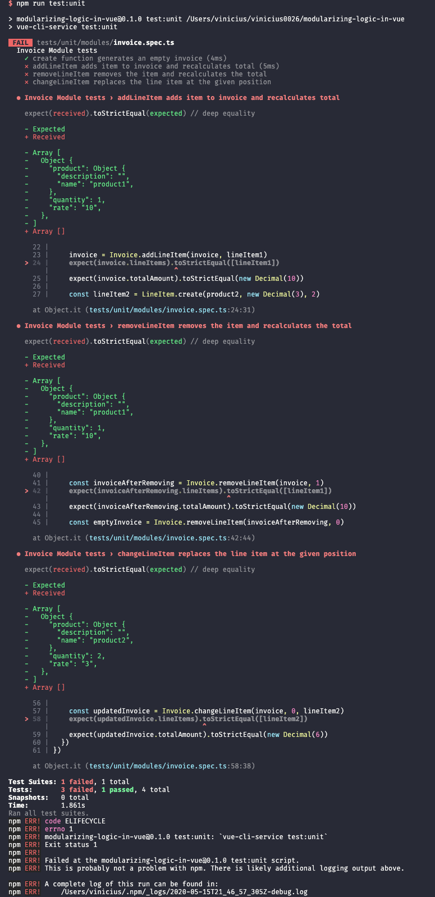
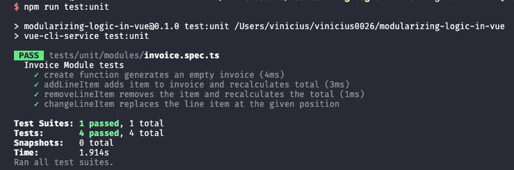

> TLDR: In this article, we discuss building a functional core for our Vue.js application logic.

---

This is the third article in our Structuring Large Vue.js Applications series. Here is the full list of released and planned articles:

- [Properly typed Vuex Stores](https://viniciusteixeira.tk/2020/05/14/properly-typed-vuex-stores/) _published May 13, 2020_
- [Adopting TypeScript in your Vue.js Application in a sane way](https://viniciusteixeira.tk/2020/05/14/adopting-typescript-in-your-vue-application-in-a-sane-way/) _published May 14, 2020_
- [Modularizing the logic of your Vue.js Application]() _published May 15, 2020_ - **You are here**
- <ins>Using services to establish a clear boundary in your Vue.js application</ins> _coming soon_
---

As an application grows, it is, unfortunately, common to see poorly designed components, with a lot of duplicate code, business logic scattered across methods, complex logic embedded in the templates, and so on. The components become large, brittle, and hard to change and test. The application becomes increasingly hard to evolve, sometimes reaching a point where the developers are eager to start from scratch, preferring a costly and risky rewrite than handling the current application state.

It doesn't have to be that way. We can and should do better. In this article, we will discuss moving the bulk of the application's business logic into a functional core that will be easy to reuse, easy to test and change, and which will lead to smaller, leaner, and more maintainable components.

We will pick up from where we left in our [previous article](https://viniciusteixeira.tk/2020/05/14/adopting-typescript-in-your-vue-application-in-a-sane-way/), so you might want to check that first if you still haven't.

## Interfaces and Functional Modules instead of Classes

When we discussed adopting TypeScript in Vue.js applications, we took a somewhat unconventional route. Instead of modeling our data around classes, we have defined very lean interfaces to add type-annotations to our data. We have only used the fields that make up our objects in the interfaces - we have not mentioned methods or any operation over the data yet.

This article does not aim at doing an in-depth debate about Functional vs. Object-Oriented programming paradigms. Both have pros and cons, but I tend to prefer a functional style, because it is easier to follow and to test, in my opinion. Thus, we will use a functional approach to build our application core, and we will try to show how it leads to a modular, testable, and reusable codebase.

We will continue developing the simplified Invoice application that we started on the [previous article](https://viniciusteixeira.tk/2020/05/14/adopting-typescript-in-your-vue-application-in-a-sane-way/).

## Planning the app functionality

Before we jump right into the code, let's talk about what functionalities we need in our application. In a real scenario, we would probably receive the requirements from a task description developed by a product team, or, if working on a side-project that we fully control, we would define that ourselves.

For our simple app, we will need ways to create and manipulate invoices. This will involve adding, removing, and changing line items, selecting products, and setting rates and quantities. We will also need a way to instantiate User and Product objects easily.

As we did for the `types` definitions, we want a modular way of building these functionalities.

## Building our modules

We will put our modules inside a `modules` directory under `src`. We will split the functionality into as many files as it is sensible to do, grouping related functionality into single modules.

Let's start with the `User` and `Product` modules:

```typescript
// src/modules/user.ts
function create(name: string = "", avatar: string = ""): Types.User {
  return {
    name,
    avatar,
  }
}

export default {
  create,
}
```

```typescript
// src/modules/product.ts
function create(name: string = "", description: string = ""): Types.Product {
  return {
    name,
    description,
  }
}

export default {
  create,
}
```

These two modules are very simple and similar, but they serve as a container for all the functionality related to users or products we might need down the road. Even though it looks that we are repeating code, we should not try to unify these create functions in any way - that would cause coupling between unrelated concepts and would make the code harder to change.

Notice how we have defined default values for all the parameters. This will allow us to call the `create` functions without passing arguments and still have a valid object of the appropriate type.

One thing you might be concerned about the code above is that we are listing all of the fields as individual parameters. We only have a couple of arguments in each of the `create` function, but the number of parameters could grow a lot as we make our models more complex. We will ignore it for now, but we will revisit this when we discuss defining a clear application boundary in a future article.

Even though we have declared the `LineItem` interface in the same file as the `Invoice`, we will use a separate file for the Invoice and LineItem modules. We could group the invoice and the line item modules using a directory, but we will keep it simple and flat for now. You can use any folder structure that suits your particular situation.

The `lineItem` module will be pretty simple as well:

```typescript
// src/modules/lineItem.ts
function create(
  product: Types.Product,
  rate: decimal.Decimal,
  quantity: number
): Types.LineItem {
  return {
    product,
    rate,
    quantity,
  }
}

export default {
  create,
}
```

Let's move on to the Invoice module now. It will be a more complex module, so we are going to stub out the functions before implementing them.

```typescript
// src/modules/invoice.ts
import Decimal from "decimal.js"

function create(user: Types.User): Types.Invoice {
  return {
    createdBy: user,
    lineItems: [],
    totalAmount: new Decimal(0),
  }
}

function addLineItem(
  invoice: Types.Invoice,
  lineItem: Types.LineItem
): Types.Invoice {
  // TODO: implement
  return invoice
}

function removeLineItem(invoice: Types.Invoice, index: number): Types.Invoice {
  // TODO: implement
  return invoice
}

function changeLineItem(
  invoice: Types.Invoice,
  index: number,
  lineItem: Types.LineItem
): Types.Invoice {
  // TODO: implement
  return invoice
}

export default {
  create,
  addLineItem,
  removeLineItem,
  changeLineItem,
}
```

## Develop the Invoice module with TDD

When we modify the line items in an invoice, by adding, removing, or changing a line item, we have to recalculate the invoice total. This is critical data in our application - we cannot afford to have the wrong amount calculated for the invoice - so we should test the invoice module thoroughly. With our modular core logic, it will be pretty straightforward to add tests.

When we scaffolded this app, we didn't add any of the unit test features available, but `vue-cli` makes it very easy to add plugins to existing projects. We will use [jest](https://jestjs.io/) to write our tests, and we can add it to our project by running:

```shell
$ vue add unit-jest
```

That will take care of installing and configuring jest to work in a Vue project. Let's write a few tests to our `Invoice` module.

```typescript
// tests/unit/modules/invoice.spec.ts
import Decimal from "decimal.js"

import User from "@/modules/user"
import Product from "@/modules/product"
import LineItem from "@/modules/lineItem"
import Invoice from "@/modules/invoice"

describe("Invoice Module tests", () => {
  it("create function generates an empty invoice", () => {
    const { user } = testData()
    const invoice = Invoice.create(user)

    expect(invoice.createdBy).toBe(user)
    expect(invoice.lineItems).toStrictEqual([])
    expect(invoice.totalAmount).toStrictEqual(new Decimal(0))
  })

  it("addLineItem adds item to invoice and recalculates total", () => {
    const { user, product1, product2 } = testData()
    const lineItem1 = LineItem.create(product1, new Decimal(10), 1)
    let invoice = Invoice.create(user)

    invoice = Invoice.addLineItem(invoice, lineItem1)
    expect(invoice.lineItems).toStrictEqual([lineItem1])
    expect(invoice.totalAmount).toStrictEqual(new Decimal(10))

    const lineItem2 = LineItem.create(product2, new Decimal(3), 2)
    invoice = Invoice.addLineItem(invoice, lineItem2)
    expect(invoice.lineItems).toStrictEqual([lineItem1, lineItem2])
    expect(invoice.totalAmount).toStrictEqual(new Decimal(16))
  })

  it("removeLineItem removes the item and recalculates the total", () => {
    const { user, product1, product2 } = testData()
    const lineItem1 = LineItem.create(product1, new Decimal(10), 1)
    const lineItem2 = LineItem.create(product2, new Decimal(3), 2)
    let invoice = Invoice.create(user)
    invoice = Invoice.addLineItem(invoice, lineItem1)
    invoice = Invoice.addLineItem(invoice, lineItem2)

    const invoiceAfterRemoving = Invoice.removeLineItem(invoice, 1)
    expect(invoiceAfterRemoving.lineItems).toStrictEqual([lineItem1])
    expect(invoiceAfterRemoving.totalAmount).toStrictEqual(new Decimal(10))

    const emptyInvoice = Invoice.removeLineItem(invoiceAfterRemoving, 0)
    expect(emptyInvoice.lineItems).toStrictEqual([])
    expect(emptyInvoice.totalAmount).toStrictEqual(new Decimal(0))
  })

  it("changeLineItem replaces the line item at the given position", () => {
    const { user, product1, product2 } = testData()
    const lineItem1 = LineItem.create(product1, new Decimal(10), 1)
    const lineItem2 = LineItem.create(product2, new Decimal(3), 2)
    let invoice = Invoice.create(user)
    invoice = Invoice.addLineItem(invoice, lineItem1)

    const updatedInvoice = Invoice.changeLineItem(invoice, 0, lineItem2)
    expect(updatedInvoice.lineItems).toStrictEqual([lineItem2])
    expect(updatedInvoice.totalAmount).toStrictEqual(new Decimal(6))
  })
})

function testData() {
  const user = User.create()
  const product1 = Product.create("product1")
  const product2 = Product.create("product2")
  return {
    user,
    product1,
    product2,
  }
}
```

These tests are a little bit lengthy, but they are easy to follow. We start by ensuring that our `create` function in the invoice module returns an empty invoice. Then we move on to test the other parts of our Invoice module. We have added a `testData` function to help creating objects used in the tests.

In a production-grade application, we would add more tests, especially to cover edge cases, making sure our module would work in every possible scenario. But for this article, this is good enough.

We should now run these tests:



As expected, the tests fail because we haven't implemented our functions yet. Let's do that now.

```typescript
// src/modules/invoice.ts
import Decimal from "decimal.js"
import LineItem from "@/modules/lineItem"

// ... create function as before

function addLineItem(
  invoice: Types.Invoice,
  lineItem: Types.LineItem
): Types.Invoice {
  const lineItems = [...invoice.lineItems, lineItem]
  return setLineItems(invoice, lineItems)
}

function removeLineItem(invoice: Types.Invoice, index: number): Types.Invoice {
  const lineItems = invoice.lineItems.filter((val, i) => i !== index)
  return setLineItems(invoice, lineItems)
}

function changeLineItem(
  invoice: Types.Invoice,
  index: number,
  newLineItem: Types.LineItem
): Types.Invoice {
  const lineItems = invoice.lineItems.map((item, i) =>
    i === index ? newLineItem : item
  )
  return setLineItems(invoice, lineItems)
}

function calculateTotal(invoice: Types.Invoice): decimal.Decimal {
  return invoice.lineItems
    .map(LineItem.calculateLineTotal)
    .reduce((sum, curr) => sum.plus(curr), new Decimal(0))
}

function setLineItems(
  invoice: Types.Invoice,
  lineItems: Types.LineItem[]
): Types.Invoice {
  const updatedInvoice = {
    ...invoice,
    lineItems,
  }
  return {
    ...updatedInvoice,
    totalAmount: calculateTotal(updatedInvoice),
  }
}

// ... export as before
```

We have created two helper functions to avoid repeating code. The first one was the `calculateTotal` function. It takes the invoice and returns the total amount. It does so by first calculating the subtotal for each line item, using a new function we have added to the LineItem module, then summing all the line item totals. Let's see what the `LineItem` module looks like now.

```typescript
// src/modules/lineItem.ts
// ... create function as before

function calculateLineTotal(lineItem: Types.LineItem): decimal.Decimal {
  return lineItem.rate.times(lineItem.quantity)
}

export default {
  create,
  calculateLineTotal,
}
```

The `calculateLineTotal` is very simple. It just multiplies the rate by the quantity. Still, having it in a separate function makes our code easier to follow and easier to change.

Back to the invoice module, we can see that the `setLineItem` helper function takes an invoice and a list of line items and then returns an updated invoice with the given line items and the calculated total amount.

With these helper functions in place, implementing our public functions is very simple - they just need to generate the new list of line items (based on the operation) and use the helper functions to return an updated invoice.

And now our tests pass!



## Using the modules in a Vue component

Let's rewrite our `createInvoice` method in the `HelloWorld.vue` component, just to have a taste of how we use our modules in a component.

```typescript
// src/components/HelloWorld.vue
import { Component, Prop, Vue } from "vue-property-decorator"
import Decimal from "decimal.js"
import User from "@/modules/user"
import Product from "@/modules/product"
import LineItem from "@/modules/lineItem"
import Invoice from "@/modules/invoice"

@Component
export default class HelloWorld extends Vue {
  @Prop() private msg!: string

  createInvoice(): Types.Invoice {
    const user = User.create("Fake User", "http://avatar-url.com")
    const product = Product.create("Fake product", "not a real product")
    const lineItem = LineItem.create(product, new Decimal(10), 1)

    let invoice = Invoice.create(user)
    invoice = Invoice.addLineItem(invoice, lineItem)

    return invoice
  }
}
```

Again, this is a contrived example, but it already looks better than before. We now have the objects with the appropriate type from the modules' create functions (instead of having just the type inference). In a more realistic scenario, the `user` would be the authenticated user; the product would come from some selector that reads from a product list; the rate and quantity would be set in the UI using inputs; and it would be possible to add/remove/update line items directly in the UI. We will build those components in the next article.

## Wrapping up

At this point, we can have a fair degree of confidence that our invoice related logic is working. We should probably add some more tests, but we have a great baseline to develop our invoice application.

We have built a solid functional core for our application logic. We are not spreading the business rules across components and, when the time comes to wire this functionality up with the UI, the components will end up being a skinny layer to connect the user actions to our core modules.

Let me know what you think of this approach in the comments!

**Shameless Plug**: If you liked this article and there are openings in our company, I'm currently looking for a job as a Senior Full Stack Engineer. You can check my [Linkedin](https://www.linkedin.com/in/antonioviniciusteixeira/) and drop me a line at _vinicius0026 at gmail dot com_ if you think I'm a good fit. Cheers! :)
