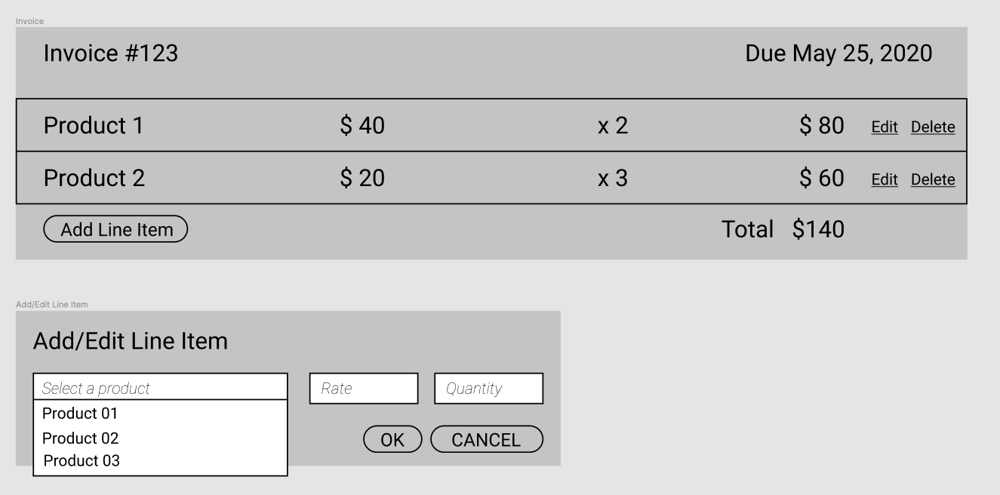
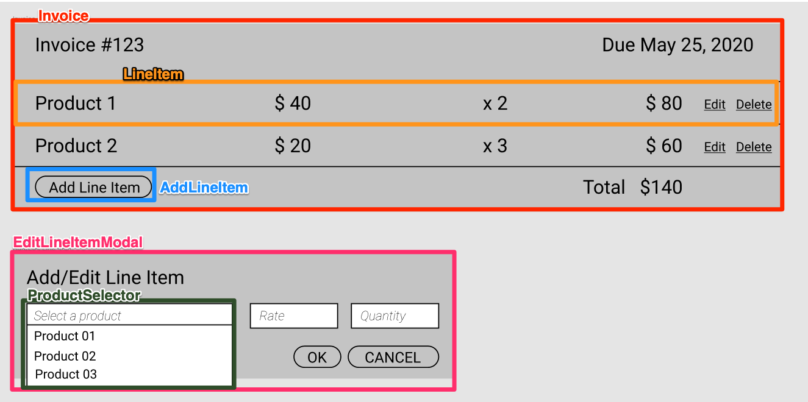

> TLDR: In this article we discuss building components based on the data definitions. Code available at [vinicius0026/data-driven-components](https://github.com/vinicius0026/data-driven-components)

---

This is the fourth article in our Structuring Large Vue.js Applications series. Here is the full list of released and planned articles:

- [Properly typed Vuex Stores](https://viniciusteixeira.tk/2020/05/14/properly-typed-vuex-stores/) _published May 13, 2020_
- [Adopting TypeScript in your Vue.js Application in a sane way](https://viniciusteixeira.tk/2020/05/14/adopting-typescript-in-your-vue-application-in-a-sane-way/) _published May 14, 2020_
- [Modularizing the logic of your Vue.js Application](https://viniciusteixeira.tk/2020/05/15/modularizing-the-logic-of-your-vue-application/) _published May 15, 2020_
- [Data-driven components]() _published May 23, 2020_ - **You are here**
- <ins>Using services to establish a clear boundary in your Vue.js application</ins> _coming soon_
---

In the previous articles, we discussed how to [adopt TypeScript in a lean way]() and how to [modularize the application logic]() in Vue.js applications. But in both articles we barely touched vue components. It's time to change that. In this article we will pick up where we left and will leverage our Type definitions and our modularized logic to build a lean, maintainable and reusable invoice component.

Before we dive in, I want to point out something. As this series deals with structuring large Vue.js applications, one might expect to see some mention to building a Design System. And that is indeed very important, but I'm afraid I don't have much to add to that subject at this moment. So I'll leave a few references to it, but I'll talk about a different subject. You can check this [article](https://www.invisionapp.com/inside-design/guide-to-design-systems/) for an introduction on Design Systems. If you want to formalize your Design System, check out [Storybook](https://storybook.js.org/) (which is primarily targeted at React, but also supports Vue.js) or [Vue Design System](https://github.com/viljamis/vue-design-system).

Now, without further ado, let's get started!

## Sketching the functionality

In our previous articles, we have defined a [simplified data model]() for an invoice application and we have built the [core logic]() for handling operations on an invoice. If you haven't checked these articles yet, now it is the time to do it.

Now, we are going to build a few components to render and manipulate an invoice.

Below we have a rough mockup of what we want the component to look like:



Please keep in mind that our goal here is to discuss code structure, so concerns such as UI and UX will be overlooked.

## Planing the components

So, how do we go about breaking up the requirements into manageable components? And, perhaps more importantly, what will the interface (props, events emitted, slots) of these components look like?

To answer this question, we are going to apply what I'm calling "Data-driven components". From our type definitions, we have the concept of `Product`, `LineItem` and `Invoice`, so we will design our components around these concepts.

Here is one possible high level breakdown of the components:



The two main components here are the `Invoice` and `LineItem` components. The Invoice component takes an invoice object of type `Types.Invoice` and, whenever this object changes, emits the updated invoice. The same thing happens for the `LineItem` component.

The `AddLineItem` component will create a bare lineItem object internally and pass it to the `EditLineItemModal` component. Whenever the user clicks the ok button in there, the `AddLineItem` component will emit this new line item to the Invoice component.

The `ProductSelector` component will encapsulate the logic for selecting a product and will emit the selected product.

If we use appropriate names for the props and events emitted, we can use Vue's `v-model` directive to bind data to our components. Let's see how that works in code.

### Invoice component

We can start by implementing the Invoice component fully, assuming the other components are available. This will generate a wish-list of components, that we will implement one by one.

```vue
// src/components/Invoice.vue
<template>
  <div>
    <div class="heading">
      <div>Invoice #123</div>
      <div>Due May 25, 2020</div>
    </div>
    <div class="line-items">
      <template v-for="(lineItem, index) in value.lineItems">
        <LineItem
          :item="lineItem"
          :index="index"
          :key="index"
          @update="editLineItem"
          @remove="removeLineItem"
        />
      </template>
      <p v-if="value.lineItems.length === 0">
        No line items
      </p>
    </div>
    <div class="footer">
      <AddLineItem @add="addLineItem" />
      Total: ${{ value.totalAmount }}
    </div>
  </div>
</template>

<script lang="ts">
import { Vue, Component, Prop, Emit } from "vue-property-decorator"
import InvoiceModule from "../modules/invoice"
import LineItem from "./LineItem.vue"
import AddLineItem from "./AddLineItem.vue"

@Component({
  components: {
    LineItem,
    AddLineItem,
  },
})
export default class Invoice extends Vue {
  @Prop({ required: true, type: Object })
  value!: Types.Invoice

  @Emit("input")
  addLineItem(newLineItem: Types.LineItem) {
    return InvoiceModule.addLineItem(this.value, newLineItem)
  }
  @Emit("input")
  editLineItem(index: number, newLineItem: Types.LineItem) {
    return InvoiceModule.changeLineItem(this.value, index, newLineItem)
  }
  @Emit("input")
  removeLineItem(index: number) {
    return InvoiceModule.removeLineItem(this.value, index)
  }
}
</script>
```

Our invoice model doesn't currently has the concept of Invoice Number or Invoice Due Date. It would be straightforward to add it to the invoice type and modify the invoice module, but to make this article simpler, we are just hard coding some values there for now.

Notice how we are taking an `Types.Invoice` prop and are emitting `input` events whenever something changes the invoice. Now our modularized Invoice logic is paying off its price. Look how simple code in our Invoice component is: it just ties the events from the underlying components to your module.

We are using the `Emit` decorator from `vue-property-decorator`. It will emit the return value of the decorated function, which makes this code really concise. If you are not used to it, it is possible to achieve the same thing by doing:

```typescript
  addLineItem(newLineItem: Types.LineItem) {
    const updatedInvoice = InvoiceModule.addLineItem(this.value, newLineItem)
    this.$emit('input', updatedInvoice)
  }
```

Notice also how we are invoking the `LineItem` and `AddLineItem` components, which are not implemented yet. Let's take care of that.

### AddLineItem component

Let's start with the `AddLineItem` component. In the `Invoice` component, we have defined that the `AddLineItem` component should emit an `add` event whenever a line item is added. Let's see how it looks like in code:

```vue
// src/components/AddLineItem.vue
<template>
  <div>
    <button @click="showModal = true">Add Line Item</button>
    <EditLineItemModal
      v-if="showModal"
      :item="newLineItem()"
      mode="create"
      @update="addLineItem"
      @close="showModal = false"
    />
  </div>
</template>

<script lang="ts">
import { Vue, Component, Emit } from "vue-property-decorator"
import EditLineItemModal from "./EditLineItemModal.vue"
import Decimal from "decimal.js"

@Component({
  components: {
    EditLineItemModal,
  },
})
export default class AddLineItem extends Vue {
  showModal = false

  newLineItem(): Types.Partial<Types.LineItem> {
    return {
      product: null,
      rate: new Decimal(0),
      quantity: 0,
    }
  }

  @Emit("add")
  addLineItem(lineItem: Types.LineItem) {
    this.showModal = false
    return lineItem
  }
}
</script>
```

This component is also rather simple. We have a button that will trigger our `EditLineItemModal` component, passing a new LineItem object to it. This new line item object is built in the `newLineItem` method. Notice how here we are using a `Types.Partial<Types.LineItem>` type.

`Types.Partial` is a helper we will add to the `types` folder to allow having incomplete objects of a certain type. In this case, we don't have a product to assign to the LineItem object, that is why we are using a partial. This how the `Types.Partial` helper is defined:

```typescript
// src/types/utils.ts
namespace Types {
  export interface Partial<T> = {
    [P in keyof T]?: T[P] | null
  }
}
```

A `Partial` object will have the same properties of the passed in type, but all fields can be `undefined` or `null`. This helper should be used with caution, because we cannot know that the properties are present.

Let's move on to the `EditLineItemModal` component now.

### EditLineItemModal component

```vue
// src/components/EditLineItemModal.vue
<template>
  <SimpleModal class="edit-line-item">
    <h3 slot="header">{{ title }}</h3>
    <div slot="body" class="edit-line-item-body">
      <label>
        Product<br />
        <ProductSelector v-model="localLineItem.product" />
      </label>
      <label for="rate">
        Rate<br />
        <input
          name="rate"
          type="number"
          placeholder="Rate"
          v-model="rate"
          class="number-input"
        />
      </label>
      <label for="quantity">
        Quantity <br />
        <input
          type="number"
          placeholder="Quantity"
          v-model.number="localLineItem.quantity"
          class="number-input"
        />
      </label>
    </div>
    <div slot="footer">
      <button @click="updateLineItem">Ok</button>
      <button @click="$emit('close')">Cancel</button>
    </div>
  </SimpleModal>
</template>

<script lang="ts">
import { Vue, Component, Prop, Watch } from "vue-property-decorator"
import { cloneDeep } from "lodash"
import ProductSelector from "./ProductSelector.vue"
import SimpleModal from "./SimpleModal.vue"
import Decimal from "decimal.js"

@Component({
  components: {
    SimpleModal,
    ProductSelector,
  },
})
export default class EditLineItemModal extends Vue {
  @Prop({ required: true, type: Object })
  item!: Types.Partial<Types.LineItem>

  @Prop({ type: String, default: "edit" })
  mode!: "edit" | "create"

  localLineItem: Types.Partial<Types.LineItem> = {
    product: null,
    rate: null,
    quantity: 0,
  }

  get title() {
    return this.mode == "edit" ? "Edit Line Item" : "Add Line Item"
  }

  get rate() {
    const rate = this.localLineItem.rate
    return rate ? rate.toNumber() : null
  }
  set rate(val) {
    this.localLineItem.rate = val ? new Decimal(val) : null
  }

  @Watch("value", { immediate: true, deep: true })
  valueChangeHandler() {
    this.localLineItem = cloneDeep(this.item)
  }

  updateLineItem() {
    this.$emit("update", this.localLineItem)
  }
}
</script>
```

We are using a `SimpleModal` component here to encapsulate the modal behavior. It is basically the same code as available in [https://vuejs.org/v2/examples/modal.html](https://vuejs.org/v2/examples/modal.html). We are not going to reproduce the modal code here, but it is available at the [repo](https://github.com/vinicius0026/data-driven-components/blob/master/src/components/SimpleModal.vue).

This component has three fields to define a LineItem: the product field, that is encapsulated in the `ProductSelector` component, and two input fields for the `rate` and `quantity`.

One thing to notice here is how we are making a local copy of the passed in prop. As we have `Ok` and `Cancel` buttons, we cannot update the prop itself when a field is changed, because the user might hit cancel. So we do a deep copy of the `item` prop into the `localLineItem` object anytime the `item` changes.

Also, as the `rate` is a `Decimal` object, we had to wrap its value in a `getter` and `setter`, so that we can transform it to and from a number, that is what the `input` html element can handle. If you have several places in your application where you need to handle Decimals, you might want to create a `DecimalInput` component that takes Decimals in and emits Decimals, so that you can use `v-model` directly with your Decimal object.

### ProductSelector

The `ProductSelector` component is a thin wrapper around the `select` element.

```vue
// src/components/ProductSelector.vue
<template>
  <select v-model="selectedProduct">
    <template v-for="(product, i) in products">
      <option :value="product" :key="i">{{ product.name }}</option>
    </template>
  </select>
</template>

<script lang="ts">
import { Vue, Component, Prop } from "vue-property-decorator"

@Component({})
export default class ProductSelector extends Vue {
  @Prop({ required: false, type: Object, default: null })
  value!: Types.Product | null

  products: Types.Product[] = [
    { name: "Product 01", description: "prod 01 description" },
    { name: "Product 02", description: "prod 02 description" },
  ]

  get selectedProduct() {
    return this.value
  }

  set selectedProduct(val) {
    this.$emit("input", val)
  }
}
</script>
```

We are hard-coding the products here to simplify our example, but in an actual application, this component would have the ability to search the products, loading them as needed from an API. The main takeaway here is that we are encapsulating the product selection in its own component, so we can change its internals easily, without affecting the other components that use it. If you need to implement a selector similar to this one, take a look at [Vue Multiselect](https://vue-multiselect.js.org/).

We have now completed the components needed to build the `AddLineItem` functionality. Let's move on to the `LineItem` component.

### LineItem component

```vue
// src/components/LineItem.vue
<template>
  <div class="line-item">
    <div class="product-name">{{ item.product.name }}</div>
    <div class="rate">$ {{ item.rate }}</div>
    <div class="quantity">x{{ item.quantity }}</div>
    <div class="line-total">$ {{ lineItemTotal }}</div>
    <div class="actions">
      <a href="#" @click.prevent="showEditModal = true">Edit</a>&nbsp;
      <a href="#" @click.prevent="removeLineItem">Delete</a>
    </div>
    <EditLineItemModal
      v-if="showEditModal"
      :item="item"
      mode="edit"
      @close="showEditModal = false"
      @update="updateLineItem"
    />
  </div>
</template>

<script lang="ts">
import { Vue, Component, Prop } from "vue-property-decorator"
import EditLineItemModal from "./EditLineItemModal.vue"
import LineItem from "../modules/lineItem"

@Component({ components: { EditLineItemModal } })
export default class LineItemComp extends Vue {
  @Prop({ required: true, type: Object })
  item!: Types.LineItem

  @Prop({ required: true, type: Number })
  index!: number

  showEditModal = false

  get lineItemTotal() {
    return LineItem.calculateLineTotal(this.item)
  }

  updateLineItem(lineItem: Types.LineItem) {
    this.$emit("update", this.index, lineItem)
    this.showEditModal = false
  }
  removeLineItem() {
    this.$emit("remove", this.index)
  }
}
</script>
```

The `LineItem` component shows the line item details, along with the line item total amount. There are also two buttons, one to edit the current line item and one to remove it from the invoice.

We are reusing the `EditLineItemModal` component we wrote for the `AddLineItem`. We emit a `LineItem` object whenever the item is edited. We also emit a `remove` event when user clicks the `Delete` link. Once again, we are using our modules logic when needed, in this case to calculate the line item total amount.

## Using the Invoice component

Now our `Invoice` component is fully developed and we can use it in our application. Let's add it to the existing `HelloWorld` component.

```vue
// src/components/HelloWorld.vue
<template>
  <div class="hello" style="width: 400px; margin: auto;">
    <Invoice v-model="invoice" />
  </div>
</template>

<script lang="ts">
import { Component, Prop, Vue } from "vue-property-decorator"
import User from "@/modules/user"
import InvoiceModule from "@/modules/invoice"
import Invoice from "@/components/Invoice.vue"

@Component({
  components: {
    Invoice,
  },
})
export default class HelloWorld extends Vue {
  get currentUser() {
    return User.create()
  }

  invoice: Types.Invoice = InvoiceModule.create(this.currentUser)
}
</script>

```

Here, we are creating a local invoice, using the Invoice module, and passing it to the Invoice component we just wrote.

The Invoice component is fully usable - we can add, remove and edit line items and the total amount is calculated correctly. In a real application, instead of just tying the Invoice component with a local data invoice object, we would probably link it to a Vuex store that would eventually trigger network requests to send the data to some API. Anyway, the invoice manipulation logic is neatly encapsulated in the component, that delegates the business logic handling to the modules.

## Validation

If you are reading closely, you might have noticed that we haven't added validation to our `EditLineItemModal` form. This could lead to a bad state in our application, because this component is taking a `Partial` line item object. Let's fix that now.

```vue
<template>
  <!-- all code as before -->
  <button @click="updateLineItem" :disabled="!isValidLineItem">Ok</button>
  <!-- all code as before -->
</template>
<script lang="ts">
  // ... all code as before
  get isValidLineItem() {
    return (
      !!this.localLineItem.product &&
      !!this.localLineItem.rate &&
      typeof this.localLineItem.quantity == "number"
    )
  }
</script>
```

This is a bit naive validation, but is enough for our purposes. Now it is not possible to save a line item if the product or rate are not set or if the quantity is not a number.

In a real application, we can use more robust validation libraries such as [Vuelidate](https://vuelidate.js.org/) or [Vee Validate](https://logaretm.github.io/vee-validate/).

## Wrapping up

We have developed a few components to create our invoice functionality. We started by defining a rough wireframe for the invoice component and have broke it down into smaller pieces.

We created small and maintainable components that are based on our type definitions. The components, as promised, are a thin layer that wires the user interactions with our core logic. As long as we keep the interface (props/events) untouched, we can change our components freely and the overall functionality should still work.

Hope you have liked this approach. Let me know your thoughts in the comments (Medium only).
