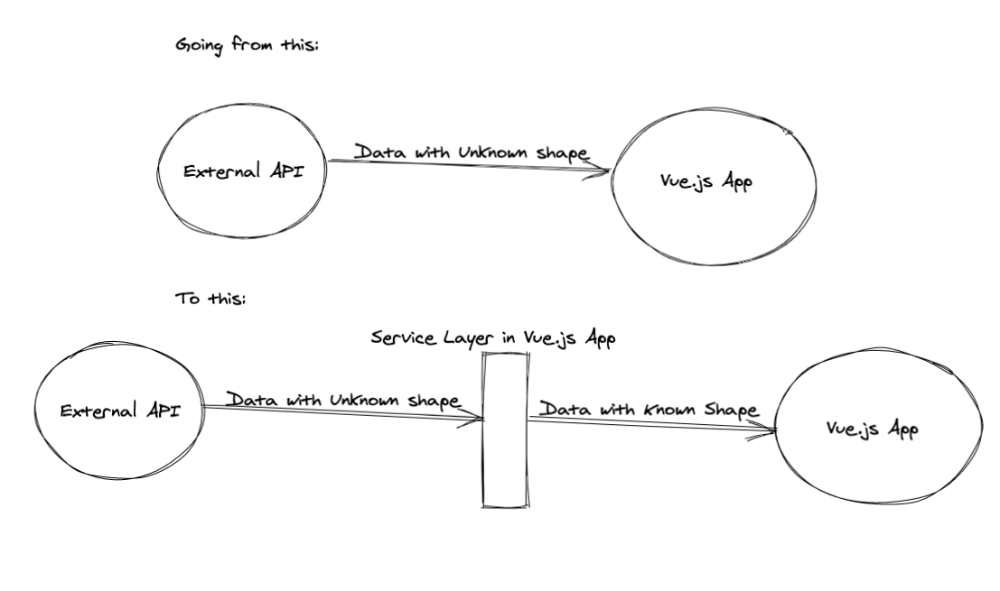

> TLDR: In this article, we discuss how to handle data at the application boundary. Code available at [vinicius0026/handling-application-boundary](https://github.com/vinicius0026/handling-application-boundary)

---

This is the fifth article in our Structuring Large Vue.js Applications series. Here is the full list of released and planned articles:

- [Properly typed Vuex Stores](https://viniciusteixeira.tk/2020/05/14/properly-typed-vuex-stores/) _published May 13, 2020_
- [Adopting TypeScript in your Vue.js Application in a sane way](https://viniciusteixeira.tk/2020/05/14/adopting-typescript-in-your-vue-application-in-a-sane-way/) _published May 14, 2020_
- [Modularizing the logic of your Vue.js Application](https://viniciusteixeira.tk/2020/05/15/modularizing-the-logic-of-your-vue-application/) _published May 15, 2020_
- [Data-driven components](https://viniciusteixeira.tk/2020/05/25/data-driven-components/) _published May 25, 2020_
- [Handling data at the edge of your Vue.js application]() _published May 28, 2020_ - **You are here**
---

In the previous articles in this series, we have dealt only with data that was local to the application, meaning that our data's entire life cycle was under control. The vast majority of the applications will have some interface with an external service, the app's REST API, more often than not.

Today, we will discuss how we can handle data at the boundary of our application, making sure we have well-formed objects of the proper type, whenever data comes into our Vue.js app from external sources.

## The problem

Whenever we reach out for external APIs, we can't know exactly the shape of the data that will be delivered to us. We have to rely on the API's documentation, if available, to build our front-end app. Still, as HTTP JSON APIs don't enforce a particular schema on the data, we should keep some distrust regarding the incoming data.

So, to increase our confidence in the data we are handling in our apps, we should establish a clear boundary between our app and the consumed APIs, making sure that all the data that comes in through this boundary is in the expected shape.

In this article, we will build a service layer that will act as the sole interface to external APIs, making sure that everything that flows across it will be in a known type.

## Using services as the application boundary



Our objective is to have a service layer that handles all external communication, making sure that the data that comes into our application is in proper shape.

We will expand the Invoice model we have discussed in previous articles and will build the service layer for the CRUD operations for invoices.

## Reviewing the Type Definitions

In a [previous article](https://viniciusteixeira.tk/2020/05/14/adopting-typescript-in-your-vue-application-in-a-sane-way/), we have defined our Invoice types as:

```typescript
// src/types/invoice.ts
namespace Types {
  export interface LineItem {
    product: Product
    rate: decimal.Decimal
    quantity: number
  }

  export interface Invoice {
    id: number | null
    createdBy: User
    lineItems: LineItem[]
    totalAmount: decimal.Decimal
  }
}

// src/types/product.ts
namespace Types {
  export interface Product {
    name: string
    description: string
  }
}

// src/types/user.ts
namespace Types {
  export interface User {
    name: string
    avatar: string
  }
}
```

We added the `id` field for the invoice, with type `number` or `null` (for when the invoice was still not created on the server-side).

Now we want to build a service layer that allows us to do CRUD operations in the invoices. Let's define the service skeleton now.

## The Service Layer

As we did when building the [core logic](https://viniciusteixeira.tk/2020/05/15/modularizing-the-logic-of-your-vue-application/) of our app, we will use the Module pattern to build our service layer. We can scaffold it like this:

```typescript
// src/services/invoice.ts
import axios from "axios"

async function createInvoice(invoice: Types.Invoice): Promise<Types.Invoice> {
  const { data } = await axios.post("/api/invoices", invoice)
  // parse and return data as a valid Invoice object
}

async function readInvoice(invoiceId: number): Promise<Types.Invoice> {
  const { data } = await axios.get(`/api/invoices/${invoiceId}`)
  // parse and return data as a valid Invoice object
}

async function updateInvoice(
  invoiceId: number,
  updatedInvoice: Types.Invoice
): Promise<Types.Invoice> {
  const { data } = await axios.put(`/api/invoices/${invoiceId}`, updatedInvoice)
  // parse and return data as a valid Invoice object
}

async function deleteInvoice(invoiceId: number) {
  await axios.delete(`/api/invoices/${invoiceId}`)
}

async function listInvoices(): Promise<Types.Invoice[]> {
  const { data } = await axios.get("/api/invoices")
  // parse and return data as a list of Invoice objects
}

export default {
  createInvoice,
  readInvoice,
  updateInvoice,
  deleteInvoice,
  listInvoices,
}
```

We are assuming a REST API accessible in the same origin as our app, with all CRUD endpoints available.

With our application accessing external data exclusively via this service, we can be sure it will receive valid objects, with a known type. Notice how we have left comments saying we need to parse the response from the API. Now, we need to write these parsing functions. They will be part of the app's core logic, in the modules, with each module being responsible for parsing their related data type. Let's see what that looks like:

## Parsing the API response

In the [last article](https://viniciusteixeira.tk/2020/05/25/data-driven-components/), we introduced a `Partial` type, for when the object didn't have all the required attributes of a type. We can reuse it here to treat the data coming from the API as a possibly partial object of the type we want.

The data provided by the API is likely to have some of the same fields (ideally all) as our front-end type definitions. But to be safe, we will assume any of the fields might be missing, using the `Partial` type to wrap all of the data coming from the API.

Let's write the invoice parsing function. We will put it in the Invoice module we have created before:

```typescript
// src/modules/invoice.ts
import Decimal from "decimal.js"
import LineItem from "@/modules/lineItem"
import User from "@/modules/user"

function parse(data?: Types.Partial<Types.Invoice>): Types.Invoice {
  return {
    id: data!.id || null,
    createdBy: User.parse(data!.createdBy || {}),
    lineItems: data!.lineItems ? data!.lineItems.map(LineItem.parse) : [],
    totalAmount: new Decimal(data!.totalAmount || 0),
  }
}

// other module functions

export default {
  // ... other exported functions
  parse,
}
```

The `parse` function takes an unknown data object, that can also be undefined. We then build a valid Invoice object by giving it a null id by default and by parsing the other fields appropriately. For the `totalAmount` field, for example, we call the `Decimal` constructor to build a valid decimal, whereas the data coming from the API would most definitely not be a decimal object - it would be a string or a number, depending on how the server serializes the data.

We have delegated the User and Line Item handling to their own modules' parse function, which we didn't implement yet. Let's do that now.

```typescript
// src/modules/user.ts

function parse(data?: Types.Partial<Types.User>): Types.User {
  return {
    name: data!.name || "",
    avatar: data!.avatar || "",
  }
}

// other module functions

export default {
  // ... other exported functions
  parse,
}
```

As our User model is very simplistic, the User `parse` function is straightforward. We just need to provide default values for the user name and avatar, in case the data coming from the API is missing these fields.

```typescript
// src/modules/lineItem.ts
import Decimal from "decimal.js"
import Product from "@/modules/product"

function parse(data?: Types.Partial<Types.LineItem>): Types.LineItem {
  return {
    product: Product.parse(data!.product || {}),
    rate: new Decimal(data!.rate || 0),
    quantity: data!.quantity || 0,
  }
}

// other module functions

export default {
  // ... other exported functions
  parse,
}
```

For the Line Item parse function, we are converting the rate into a valid Decimal object (as we did for the Invoice total amount); we are giving the quantity field a default of 0 and are delegating the product parsing to its own module. Let's see how that looks:

```typescript
function parse(data?: Types.Partial<Types.Product>): Types.Product {
  return {
    name: data!.name || "",
    description: data!.description || "",
  }
}

// other module functions

export default {
  // ... other exported functions
  parse,
}
```

Similar to the User parse function, parsing the product is very straightforward.

With that, we have written parsers to all our data types, and we can now plug the Invoice parse function into the Invoice service.

Below is our final implementation of the Invoice service:

```typescript
import axios from "axios"
import Invoice from "../modules/invoice"

async function createInvoice(invoice: Types.Invoice): Promise<Types.Invoice> {
  const { data } = await axios.post("/api/invoices", invoice)
  return Invoice.parse(data)
}

async function readInvoice(invoiceId: number): Promise<Types.Invoice> {
  const { data } = await axios.get(`/api/invoices/${invoiceId}`)
  return Invoice.parse(data)
}

async function updateInvoice(
  invoiceId: number,
  updatedInvoice: Types.Invoice
): Promise<Types.Invoice> {
  const { data } = await axios.put(`/api/invoices/${invoiceId}`, updatedInvoice)
  return Invoice.parse(data)
}

async function deleteInvoice(invoiceId: number) {
  await axios.delete(`/api/invoices/${invoiceId}`)
}

async function listInvoices(): Promise<Types.Invoice[]> {
  const { data } = await axios.get("/api/invoices")
  return Array.isArray(data) ? data.map(Invoice.parse) : []
}

export default {
  createInvoice,
  readInvoice,
  updateInvoice,
  deleteInvoice,
  listInvoices,
}
```

Notice how simple the service has turned out, as we are delegating the parsing logic to the Invoice module. The service responsibility is to talk to the API and then pipe the API's response to the parsing logic into the module. This will ensure that the return type of the service is known.

## Handling mismatch of payload shapes

In the preceding examples, we assumed the shape of objects coming from the API is similar to the form of objects in our Vue.js application. If we control both sides of the equation, we can (and probably should) enforce that. But sometimes we either don't control the server-side or can't change it for whatever reason.

If that is the case, we can declare a specific type for the data coming from the API, wrap it in a Partial type, and then convert it to a proper type inside our application.

For the sake of building an example, let's say that the `Product` object in the payload has different field names: `product_name` instead of `name` and `product_desc` instead of `description`. We can handle this situation as follows:

```typescript
// src/modules/product.ts

interface ApiProduct {
  product_name: string
  product_desc: string
}

function parse(data?: Types.Partial<ApiProduct>): Types.Product {
  return {
    name: data!.product_name || "",
    description: data!.product_desc || "",
  }
}
```

We have declared the `ApiProduct` interface, to represent the shape of the Product sent by the API.

We don't need to export this interface to the rest of the application, nor declare it inside our Types namespace. It is intended to be used solely in the parse function. In the rest of the app, we should use only the proper `Types.Product` type.

If we need to convert back from the app `Product` type to the API's `ApiProduct` type (when handling Product CRUD, for example), we should add a function to the Product module that does that conversion. We can call it whatever we want, as long as we are consistent with naming across our modules.

## Getting notifications for unexpected API responses

In the examples we built in this article, we are ignoring the fact that the API didn't send a full object of the expected type. Sometimes that might be all we need to do. But on most occasions, we should be notified about and fix our API (if that's something we control) or our parsing functions.

The `parse` functions we wrote are the perfect place to do that. If you are using something like [Sentry](https://sentry.io/) to collect front-end exceptions, you can raise an exception if there is any missing field, which will be caught by Sentry. Or you can use the [Capture Console](https://docs.sentry.io/platforms/javascript/#captureconsole) integration and log an error and return a valid default (like we did in the examples) so that the application is still usable, even if there's some data missing.

```typescript
function parse(data?: Types.Partial<Types.User>): Types.User {
  return {
    name: data!.name || (console.warn('Missing user.name in API response') || ""),
    avatar: data!.avatar || "",
  }
}
```

## Wrapping up

We have created a clear boundary for our application, using services to convert data coming from external sources (such as our backend API), making sure that the data coming into our app will have a known shape.

We have created `parse` functions in each of our modules to handle the transformation from a potentially incomplete object into a known and type-complying object.

We discussed how to parse data in a completely different format, without polluting our global Types with transformation-only types.

The resulting service and parse functions are short, easy to reason about, and easy to test, making us more confident of the application state.
